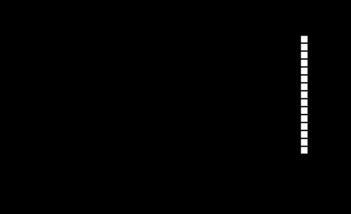
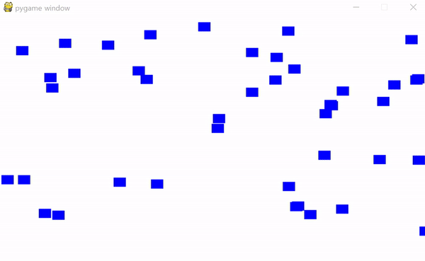
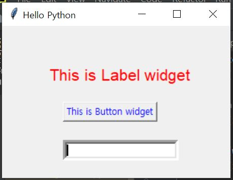
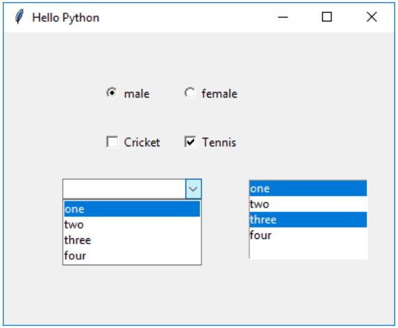
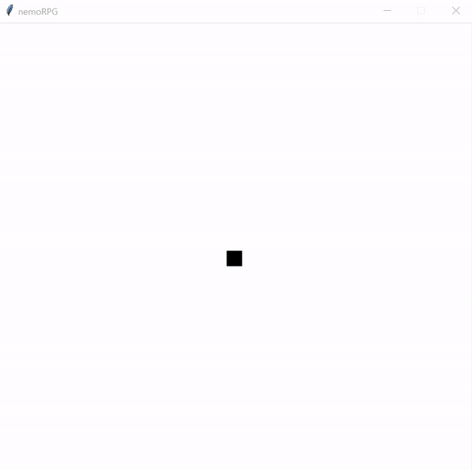
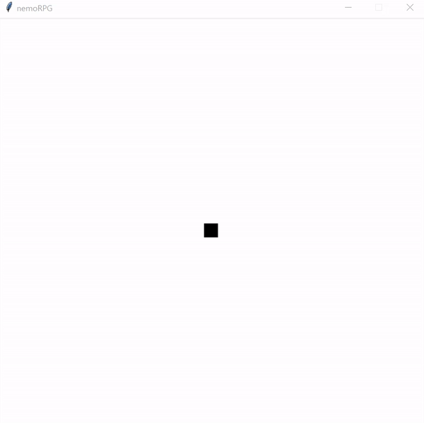

### 3.2 'pygame' 실습 1
```python
import pygame
```
pygame묘듈을 가져옵니다.
```python
BLACK = (0, 0, 0)
WHITE = (255, 255, 255)
segment_width = 15
segment_height = 15
segment_margin = 3
x_change = segment_width + segment_margin
y_change = 0

```
전역변수로 BLACK와WHITE를 지정한 후 snake게임의 높이와 너비, 그리고 그 부분 사이의 여백을 지정합니다. <br>그후 snake의 x축으로의 변화와 y축으로의 변화(속도)를 지정합니다.
```python
class Segment(pygame.sprite.Sprite):
    def __init__(self, x, y):
        super().__init__()
        self.image = pygame.Surface([segment_width, segment_height])
        self.image.fill(WHITE)
        self.rect = self.image.get_rect()
        self.rect.x = x
        self.rect.y = y

```
snake게임의 객체들의 일부분을 표현하는 Segment클래스로 객체의 이미지의 높이, 너비, 색, 그리고 객체의 사각형을 만든 후 x축, y축으로를 표현하고 있습니다.<br>
그리고 Sprite의 개념을 이해해야 이 게임을 만들 수 있는데 다른 이미지와 합성하기 위해 사용하는 이미지나 애니메이션을 말합니다. “게임 화면 내에서 움직이는 물체”라고 생각해도 됩니다.
```python
pygame.init()
screen = pygame.display.set_mode([800, 600])
pygame.display.set_caption('Snake Example')
allspriteslist = pygame.sprite.Group() 

```
pygame을 시작하고 창너비 ,높이와 표시될 프로그램이름을 지정한후 pygame.sprite.Group()을 allspriteslist로 지정하고 있습니다.<br> 이후에는 pygame.sprite.Group()의 메소드를 쓸 때 allspriteslist로 더 간편하게 쓸 수 있습니다.
```python
snake_segments = []
for i in range(15):
    x = 250 - (segment_width + segment_margin) * i
    y = 30
    segment = Segment(x, y)
    snake_segments.append(segment)
    allspriteslist.add(segment)

```
 snake_segments라는 빈 배열을 만든 후 위에서 만든 클래스를 이용하여 만든 값들을 빈 배열과 스프라이트 그룹에 추가하여 snake게임의 초기상태를 만듭니다.
```python
if event.type == pygame.KEYDOWN:
            if event.key == pygame.K_LEFT:
                x_change = (segment_width + segment_margin) * -1
                y_change = 0
            if event.key == pygame.K_RIGHT:
                x_change = (segment_width + segment_margin)
                y_change = 0
            if event.key == pygame.K_UP:
                x_change = 0
                y_change = (segment_height + segment_margin) * -1
            if event.key == pygame.K_DOWN:
                x_change = 0
                y_change = (segment_height + segment_margin)


```
키 누르는 것에 따라 x축으로의 그리고 y축으로의 변화가 어떻게 변하는지 설정합니다.
```python
   old_segment = snake_segments.pop()
   allspriteslist.remove(old_segment)
 
   x = snake_segments[0].rect.x + x_change
   y = snake_segments[0].rect.y + y_change
   segment = Segment(x, y)
   snake_segments.insert(0, segment)
   allspriteslist.add(segment)

```
 마지막 요소를 배열과 스프라이트 그룹에서 제거합니다. 그리고 새로운 요소가 어디있을지 알아낸 뒤 배열과 스프라이트 그룹에 추가합니다.
```python
    screen.fill(BLACK)
    allspriteslist.draw(screen)
    pygame.display.flip()
    clock.tick(5)
pygame.quit()

```
화면이 어두운색으로 바뀌고 스프라이트 그룹에 요소들을 다 보여준후 시간을 멈추고 pygame은 종료됩니다.<br><br>
위 프로젝트를 실행시키면 아래와 같이 누르는 방향 키에 따라 움직이는 모습을 확인할 수 있습니다.<br>
<br>

### 3.2 'pygame' 실습 2


```python
import pygame
```
pygame 실습이므로, pygame모듈을 가져옵니다.
```python
BLACK = (0, 0, 0)
WHITE = (255, 255, 255)
```
전역변수로 BLACK과 WHITE를 지정합니다.


```python
class Player(pygame.sprite.Sprite):

    def __init__(self, x, y):

        super().__init__()
 
        self.image = pygame.Surface([15, 15])
        self.image.fill(BLACK)
 
        self.rect = self.image.get_rect()
        self.rect.x = x
        self.rect.y = y
 
        self.change_x = 0
        self.change_y = 0
```
게임의 객체들의 일부분을 표현하는 Player클래스로 객체의 이미지의 높이, 너비, 색, 그리고 객체의 사각형을 만든 후 x축, y축으로를 표현하고 속도를 0으로 초기화 하였습니다.
```python
    def changespeed(self, x, y):
        self.change_x += x
        self.change_y += y
 
    def update(self):
        self.rect.x += self.change_x
        self.rect.y += self.change_y
```
객체의 속도를 어느만큼 변화시킬지를 정하고 객체의 새로운 위치를 지정해줍니다.
```python
pygame.init()
 
screen = pygame.display.set_mode([800, 600])
 
pygame.display.set_caption('Test')

player = Player(50, 50)
all_sprites_list = pygame.sprite.Group()
all_sprites_list.add(player)
```
pygame을 시작하고 창 너비, 높이와 표시될 프로그램 이름을 지정한 후 pygame.sprite.Group()을 all_sprites_list로 지정하고 있습니다.
이후에는 pygame.sprite.Group()의 메소드를 쓸 때 all_sprites_list로 더 간편하게 쓸 수 있습니다. 그리고 all_sprites_list에 player 객체를 추가합니다.
```python
        elif event.type == pygame.KEYDOWN:
            if event.key == pygame.K_LEFT:
                player.changespeed(-3, 0)
            elif event.key == pygame.K_RIGHT:
                player.changespeed(3, 0)
            elif event.key == pygame.K_UP:
                player.changespeed(0, -3)
            elif event.key == pygame.K_DOWN:
                player.changespeed(0, 3)
 
        # Reset speed when key goes up
        elif event.type == pygame.KEYUP:
            if event.key == pygame.K_LEFT:
                player.changespeed(3, 0)
            elif event.key == pygame.K_RIGHT:
                player.changespeed(-3, 0)
            elif event.key == pygame.K_UP:
                player.changespeed(0, 3)
            elif event.key == pygame.K_DOWN:
                player.changespeed(0, -3)
```
어느 방향키를 누르는지에 따라 x축, y축으로 변화가 얼만큼 일어날지 지정해줍니다.
```python
    screen.fill(WHITE)
    all_sprites_list.draw(screen)
    pygame.display.flip()
    clock.tick(60)
 pygame.quit()
```
화면이 하얀 색으로 바뀌고 스프라이트 그룹에 요소들을 다 보여준 후 시간을 멈추고 pygame은 종료됩니다.<br><br>
위 프로젝트를 실행시키면 아래와 같이 누르는 방향 키에 따라 움직이는 모습을 확인할 수 있습니다.<br>


### 3.2 'pygame' 실습 3
```python
import pygame
import random
```
게임을 만드는데 필요한 pygame, random 라이브러리를 import 해줍니다.
```python
BLACK = (0, 0, 0)
WHITE = (255, 255, 255)
RED = (255, 0, 0)
BLUE = (0, 0, 255)
```
게임에서 사용할 색상들을 위 코드처럼 작성하여 전역변수로 지정해줍니다.
```python
class Block(pygame.sprite.Sprite):

    def __init__(self, color):

        super().__init__()
 
        self.image = pygame.Surface([20, 15])
        self.image.fill(color)
 
        self.rect = self.image.get_rect()
```
슈팅 게임의 객체들 중 총알을 맞춰야할 블럭을 표현하는 Block 클래스로 블럭의 크기, 색, 모양을 지정합니다.

```python
class Player(pygame.sprite.Sprite):
 
    def __init__(self):

        super().__init__()
 
        self.image = pygame.Surface([20, 20])
        self.image.fill(RED)
        self.rect = self.image.get_rect()
 
    def update(self):

        pos = pygame.mouse.get_pos()
        self.rect.x = pos[0]
```
슈팅 게임의 객체들 중 사용자가 직접 마우스로 플레이 할 슈팅머신을 표현하는 player 클래스로 슈팅머신의 크기, 색, 모양을 지정하고, 마우스의 x축을 따라 이동하도록 설정해줍니다.
```python
class Bullet(pygame.sprite.Sprite):
    """ This class represents the bullet . """
    def __init__(self):
        # Call the parent class (Sprite) constructor
        super().__init__()
 
        self.image = pygame.Surface([4, 10])
        self.image.fill(BLACK)
 
        self.rect = self.image.get_rect()
 
    def update(self):
        self.rect.y -= 3
```
슈팅 게임의 객체들 중 슈팅머신에서 발사되는 총알을 표현하는 bullet 클래스로 총알의 크기, 색, 모양을 지정하고, 총알이 y축을 따라 움직이도록 속도를 설정해줍니다.
```python
pygame.init()
 
# Set the height and width of the screen
screen_width = 700
screen_height = 400
screen = pygame.display.set_mode([screen_width, screen_height])
 
# --- Sprite lists
 
# This is a list of every sprite. All blocks and the player block as well.
all_sprites_list = pygame.sprite.Group()
 
# List of each block in the game
block_list = pygame.sprite.Group()
 
# List of each bullet
bullet_list = pygame.sprite.Group()
```
위 프로젝트를 실행시키면 아래와 같이 빨간 사각형이 마우스를 따라 움직이며 클릭 시 총알이 발사되는 모습을 확인할 수 있습니다.<br>


### 4.2 'tkinker' 실습 2


```python
from tkinter import *
window=Tk()

btn=Button(window, text="This is Button widget", fg='blue')
btn.place(x=80, y=100)

lbl=Label(window, text="This is Label widget", fg='red', font=("Helvetica", 16))
lbl.place(x=60, y=50)

txtfld=Entry(window, text="This is Entry Widget", bd=5)
txtfld.place(x=80, y=150)

window.title('Hello Python')
window.geometry("300x200+10+20")
window.mainloop()
```
tkinker 실습이므로, tkinker모듈을 가져옵니다.<br>
Tk()함수를 이용해 window를 생성하고 그 안에 여러 widget을 추가 합니다.<br>
widget을 button, label, entry 세가지 형태로 추가합니다.<br>
window의 title을 Hello Python으로 지정해주고, 크기도 정해줍니다.<br>
위 프로젝트를 실행시키면 아래와 같은 window 를 확인할 수 있습니다.<br>


```python
from tkinter import *
from tkinter.ttk import Combobox
window=Tk()
var = StringVar()
var.set("one")
data=("one", "two", "three", "four")
cb=Combobox(window, values=data)
cb.place(x=60, y=150)

lb=Listbox(window, height=5, selectmode='multiple')
for num in data:
    lb.insert(END,num)
lb.place(x=250, y=150)

v0=IntVar()
v0.set(1)
r1=Radiobutton(window, text="male", variable=v0,value=1)
r2=Radiobutton(window, text="female", variable=v0,value=2)
r1.place(x=100,y=50)
r2.place(x=180, y=50)
                
v1 = IntVar()
v2 = IntVar()
C1 = Checkbutton(window, text = "Cricket", variable = v1)
C2 = Checkbutton(window, text = "Tennis", variable = v2)
C1.place(x=100, y=100)
C2.place(x=180, y=100)

window.title('Hello Python')
window.geometry("400x300+10+10")
window.mainloop()
```
tkinker 실습이므로, tkinker모듈을 가져옵니다.<br>

Radiobutton: 이 위젯은 ON/OFF 상태를 가진 토글 단추를 표시합니다. 단추가 두 개 이상 있을 수 있지만 한 번에 하나만 켜져 있습니다.<br>

Checkbutton: 이 버튼도 토글 버튼입니다. 캡션 앞에 직사각형 확인란이 나타납니다. ON 상태는 상자에 있는 눈금 표시로 표시되며 OFF를 클릭하면 사라집니다.<br>

Combobox: 이 클래스는 tkinter 패키지의 ttk 모듈에 정의되어 있습니다. 목록에서 하나의 값만 선택하는 드롭 다운 데이터만 허용합니다. <br>

Listbox: 콤보 상자와는 달리 이 위젯은 문자열 항목의 전체 컬렉션을 표시합니다. 사용자는 하나 이상의 항목을 선택할 수 있습니다.<br>
위 프로젝트를 실행시키면 아래와 같은 window 를 확인할 수 있습니다.<br>

```python
from tkinter import *
class MyWindow:
    def __init__(self, win):
        self.lbl1=Label(win, text='First number')
        self.lbl2=Label(win, text='Second number')
        self.lbl3=Label(win, text='Result')
        self.t1=Entry(bd=3)
        self.t2=Entry()
        self.t3=Entry()
        self.btn1 = Button(win, text='Add')
        self.btn2=Button(win, text='Subtract')
        self.lbl1.place(x=100, y=50)
        self.t1.place(x=200, y=50)
        self.lbl2.place(x=100, y=100)
        self.t2.place(x=200, y=100)
        self.b1=Button(win, text='Add', command=self.add)
        self.b2=Button(win, text='Subtract')
        self.b2.bind('<Button-1>', self.sub)
        self.b1.place(x=100, y=150)
        self.b2.place(x=200, y=150)
        self.lbl3.place(x=100, y=200)
        self.t3.place(x=200, y=200)
    def add(self):
        self.t3.delete(0, 'end')
        num1=int(self.t1.get())
        num2=int(self.t2.get())
        result=num1+num2
        self.t3.insert(END, str(result))
    def sub(self, event):
        self.t3.delete(0, 'end')
        num1=int(self.t1.get())
        num2=int(self.t2.get())
        result=num1-num2
        self.t3.insert(END, str(result))

window=Tk()
mywin=MyWindow(window)
window.title('Hello Python')
window.geometry("400x300+10+10")
window.mainloop()

```
<br> bind() 메소드를 이용하여 <Button-1> 이라는 이벤트가 발생할때 self.sub라는 함수를 연결해줍니다.<br>
위 프로젝트에는 두 개의 텍스트 입력 필드와 결과를 표시하는 다른 텍스트 입력 필드가 있습니다.<br> 덧셈 및 뺄셈 캡션이 있는 두 개의 단추 개체가 있습니다. 사용자는 두 항목 위젯에 번호를 입력할 수 있습니다. 이들의 덧셈 또는 뺄셈의 결과가 세 번째에 표시됩니다.

첫 번째 단추(add)는 명령 매개 변수를 사용하여 구성됩니다. 그 값은 클래스의 메서드입니다. 두 번째 버튼은 메소드를 사용하여 마우스 왼쪽 버튼 클릭을 메소드에 등록합니다. <br> 두 방법 모두 항목 위젯의 방법으로 텍스트 필드의 내용을 읽고, 숫자를 분석하여 덧셈/뺄셈을 수행하고 메서드를 사용하여 결과를 세 번째 텍스트 필드에 표시합니다.<br>

### 4.2 'tkinker' 실습 3
```python
from tkinter import *
import time

window = Tk()
window.title("nemoRPG")
window.resizable(0,0)
canvas = Canvas(window, width = 640, height = 640, bg = "white")
canvas.pack()
```
tkinter 모듈과 time라이브러리를 불러옵니다.
canvas 크기를 정해주고, pack() 하여 화면에 표시해 줍니다.<br>
실행하면 네모난 창이 생기고 이는 게임의 틀이자 룸으로 불리는 배경이 생깁니다.<br>

```python
from tkinter import *
import time

window = Tk()
window.title("nemoRPG")
window.resizable(0,0)
canvas = Canvas(window, width = 640, height = 640, bg = "white")
canvas.pack()

class Game:
    def __init__(self):
        self.keys =set()
        window.bind("<KeyPress>", self.keyPressHandler)
        window.bind("<KeyRelease>", self.keyReleaseHandler)

        test = canvas.create_rectangle(310, 310, 330, 330, fill = "black")

        while(1):
            for key in self.keys:
                if key == ord('A'):
                    canvas.move(test, -5, 0)

            window.update()
            time.sleep(0.01)

def keyPressHandler(self, event):
    self.keys.add(event.keycode)

def keyReleaseHandler(self, event):
    if event.keycode in self.keys:
        self.keys.remove(event.keycode)

Game()
```
Game 클래스는 UI드로잉과 버튼 감지 다른 오브젝트들의 스텝을 처리해줍니다.<br>
while 문으로 계속 업데이트 하여 움직이는 효과를 줍니다.<br>\
위 프로젝트를 실행시키면 키보드의 'A' 키를 눌렀을 때 네모가 왼쪽으로 움직이는 것을 확인할 수 있습니다.
<br><br>
버튼을 눌렀을때 keyPressHandler함수가 keys 세트에 버튼을 추가해 줍니다. 땠을때는 반대로 keyRelasedHandler함수가 작동하여 세트에서 버튼을 제거해 줍니다.<br>

이후 수정된 keys세트를 메인 루프에서 for문으로 돌려 버튼을 하나하나 체크해 줍니다. 해당키가 눌러졌으면, 캠퍼스를 이동합니다.<br>

while 문의 window.update 함수는 반복문이 실행될 때마다 canvas에서 변경된 값들을 업데이트 해 줍니다. time.sleep 함수는 해당 시간만큼 딜레이를 주어 게임의 속도를 조절해 줍니다.<br>
```python
from tkinter import *
import time

window = Tk()
window.title("nemoRPG")
window.resizable(0,0)
canvas = Canvas(window, width = 640, height = 640, bg = "white")
canvas.pack()

class Game:
    def __init__(self):
        self.keys =set()
        window.bind("<KeyPress>", self.keyPressHandler)
        window.bind("<KeyRelease>", self.keyReleaseHandler)

        test = canvas.create_rectangle(310, 310, 330, 330, fill = "black")

        while(1):
            for key in self.keys:
                if key == ord('A'):
                    canvas.move(test, -5, 0)
                if key == ord('D'):
                    canvas.move(test, 5, 0)
                if key == ord('W'):
                    canvas.move(test, 0, -5)
                if key == ord('S'):
                    canvas.move(test, 0, 5)

            window.update()
            time.sleep(0.01)

    def keyPressHandler(self, event):
            self.keys.add(event.keycode)

    def keyReleaseHandler(self, event):
        if event.keycode in self.keys:
            self.keys.remove(event.keycode)

Game()
```
위 프로젝트는 기존 프로젝트에서 버튼만 여러개 추가 시킨 것으로 4방향으로 이동하는 게임을 구현할 수 있습니다.
<br><br>
